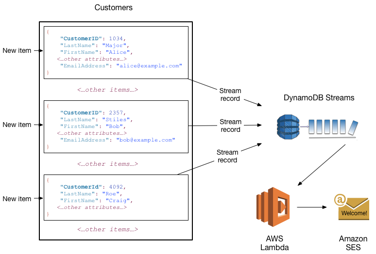

# Amazon DynamoDB

## Core Components

### TABLE, ITEM, ATTRIBUTE

**Table**: a collection of *items* \
**Item (row)**: a collection of *attributes* with a *primary key*
+ Tables can have unlimited items

**Attribute (column)**: fundamental data element
+ Items in a table can have different non-*primary key* attributes -> **schemaless**

Example:

```json
// Person 1
{
  "EmployeeId": 123, // primary key
  "EmployeeName": "John",
  "EmployeeAddress": {
    "Street": "42 Wallaby Way",
    "City": "Boston",
    "State": "MA",
    "ZipCode": "01106"
  }
}
// Person 2
{
  "EmployeeId": 456, // primary key
  "EmployeeName": "Smith",
  "EmployeeSalary": 6
}
```

### PRIMARY KEY

**Primary Key (PK)**: attribute for item which uniquely identifies it in table

Items are required to have a PK \
PK attributes must be scalar \
All items in a table must collectively adhere to one of the two supported PK schemes:
  + **Partition Key** - single attribute PK
  + **Partition and Sort Key (Composite PK)** - composite PK
    + two items can have same partition key, but must have different sort key
     ```javascript
    // physical storage location
    partition = hash(partitionKey)

    // put in sorted order if composited PK
    if (sortKeyPresent) {
        putItem(item, sortKey)
    }
    ```

**TAKEAWAY:** Items with same *partition key* are physically close together. If a *sort key* is present, items with the same *partition key* can use *sort key* as a metric for physical proximity.

### SECONDARY INDEXES

Enables table queries using an alternate key, in addition to PK
Two supported indexes:
+ **Global Secondary Index (GSI)** - parition key and sort key, both can differ from table
    + Default limit per table: 20
+ **Local Secondary Index (LSI)** - same partition key as table, different sort key
    + Default limit per table: 5

Each index is belongs to its *base table*, which must **at minimum** project its primary key attributes onto its indices.

Example:

```json
// Employee Table (base table)
{
  "EmployeeId": 123,           // partition key
  "EmployeeDetails": {
    "DateOfBirth": "01/01/01",
    "DateOfDeath": "01/02/01"
  },
  "CityOfBirth": "Boston",
  "Age": 100
}

// CityOfBirthAndAge Table (index)
{
  "CityOfBirth": "Boston",
  "Age": 100,
  "EmployeeId": 123
}
```

Indices are updated whenever corresponding base table items are updated.

**TAKEAWAY**: Pick your indeces wisely. Local secondary index queries are faster if you primarily search by sort key (you have to provide partition key regardless). Global secondary indices offer more flexibility for slower searches.

### DYNAMODB STREAMS

Whenever an event where items in a table are updated, a *stream record* is published:
+ New item added - item in stream record
+ Item update - before/after in stream record
+ Item deleted - item in stream reocrd

Stream records have lifetime of 24 hr.

Here is an example usecase with Lambda and SES. When new employees w/ email addresses join, they are sent a 'Welcome' email:



## API

### CONTROL PLANE (DDL)

Create and manage tables. Work with indices, streams.
+ *CreateTable, DescribeTable, ListTables, UpdateTable, DeleteTable*

### DATA PLANE (DML/CRUD)

**Create**
+ *PutItem* - write single item by PK [Table] 
+ *BatchWriteItem* - write/delete <= items [Table]
    + Better than calling *PutItem* 25 times (24 less network RTs)

**Read**
+ *GetItem* - read single item by PK [Table]
+ *BatchGetItem* - read <= 100 items [Table] 
+ *Query* - get all items with specific partition key [Table/Index]
    + Can apply inSortedOrder condition on result (sort key required)
+ *Scan* - get all items [Table/Index]
    + Can apply filtering conditions to discard certain items  

**Update**
+ *UpdateItem* - modify >= 1 attributes in item by PK [Table]
    + Conditional updates - updates only successful when user-defined condition met
    + Atomic counter - for numeric attribute update (atomicity)

**Delete**
+ *DeleteItem* - delete single item by PK [Table]
+ *BatchWriteItem* - delete/write <= 25 items [Table]

### STREAMS

+ *ListStreams* - ...
+ *DescribeStream* - get info about stream
+ *GetShardIterator* - data structure used to get records from stream
+ *GetRecords* - using shard iterator, gets stream records

### TRANSACTIONS (ACID)

+ *TransactWriteItems* - batch op allows *Put, Update, Delete* ops to multiple items within/across tables a guaranteed all-or-nothing result
+ *TransactGetItems* - batch op for *Get* ops for multiple itmes across tables

## Data Types

+ **Scalar** - string, number, binary, Boolean, null
    + Number - 38 digits of precision, variable length representation
    + String - 400 KB size limit per item
        + Max partition key length 2 KB
        + Max sort key length is 1 KB
    + Binary - store compressed text, encrypted data, images (unsigned)
        + Max length 400 KB per item
        + Same partition and sort key constraints as for strings
        + Binary must be base64-encoded
    + Boolean - true or fase
    + Null - undefined state

+ **Document** - list, map
  + 32 levels of deep max
  + No limit to # of values in document, so long as item overall <= 400 KB
  + List - does not have to be of same type
  + Map - like JSON
+ **Set** - multiple scalar values (string, number, binary sets)
  + No limit, so long as item overall <= 400 KB
  + items have to be of same type and unique, and non-empty


## Read Consistency

Tables are regional, so same name in different regions = different table.\
Each region has Availability Zones (AZs) that offer cheap, low-latency connectivity to toher AZs, which allows rapid replication. There are two supported reads:

### EVENTUALLY CONSISTENT

Read after write could respond w/ stale data. After *some* time, it will be the latest data.\
This is the default read behaviour.

### STRONGLY CONSISTENT

Read after write responds with most up-to-date data
+ Might not be available during network delay or outage
+ Not supported on GSIs

Can specify *ConsistentRead* param in read ops.

## Read/Write Capacity Mode

## Partitions and Data Distribution
